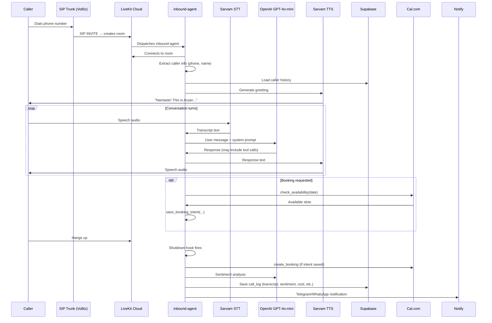
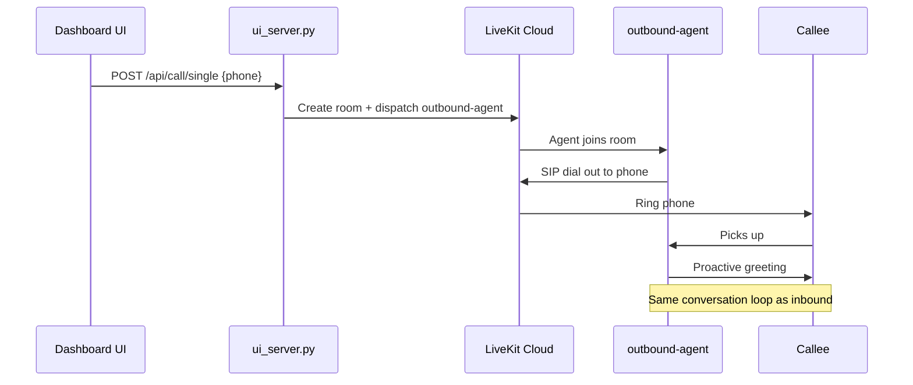

# ARCHITECTURE.md — RapidX AI Voice Agent System Overview

## Module Map

```
InboundAIVoiceShreyas/
├── agent.py                 # CLI entry point — registers both workers with LiveKit
├── agents/                  # Agent package
│   ├── __init__.py          # Exports inbound/outbound entrypoints
│   ├── base.py              # Shared: provider factories, session builder, shutdown hook
│   ├── inbound.py           # InboundAssistant + inbound_entrypoint
│   └── outbound.py          # OutboundAssistant + outbound_entrypoint
├── config.py                # Pydantic BaseSettings + config.json merge + language presets
├── utils.py                 # Standalone helpers: tokens, IST time, rate limiter, email
├── tools.py                 # AgentTools (LLM-callable functions: booking, transfer, etc.)
├── db.py                    # Supabase CRUD for call_logs
├── calendar_tools.py        # Cal.com + Google Calendar integration
├── notify.py                # Telegram + WhatsApp notifications
├── make_call.py             # CLI for dispatching single outbound calls
├── setup_trunk.py           # LiveKit SIP trunk configuration
├── ui_server.py             # FastAPI dashboard + REST API (APIRouter-based)
├── templates/
│   ├── dashboard.html       # Main dashboard UI (Jinja2 template)
│   └── demo.html            # Browser demo call page
├── config.json              # Dashboard-editable settings
├── configs/                 # Per-client config overrides (e.g., configs/919876543210.json)
├── requirements.txt         # Python dependencies
├── .env                     # Secret credentials (not committed)
└── .env.example             # Template for .env
```

---

## Call Flow

### Inbound Call (SIP → Agent)



### Outbound Call (Dashboard → Agent)



---

## Configuration Flow

```
Priority (highest → lowest):
  1. configs/{phone}.json     ← per-client override
  2. configs/default.json     ← shared override
  3. config.json              ← dashboard-editable defaults
  4. .env                     ← environment variables (via Pydantic BaseSettings)
```

Config is merged at call time by `config.get_live_config(phone_number)`.
The dashboard reads/writes `config.json` via `config.read_config_json()` / `config.write_config_json()`.

---

## Key Environment Variables

| Variable | Purpose |
|----------|---------|
| `LIVEKIT_URL` | LiveKit Cloud WebSocket URL |
| `LIVEKIT_API_KEY` / `SECRET` | LiveKit authentication |
| `OPENAI_API_KEY` | GPT-4o-mini (LLM + sentiment) |
| `SARVAM_API_KEY` | STT (Saaras v3) + TTS (Bulbul v3) |
| `CAL_API_KEY` / `CAL_EVENT_TYPE_ID` | Cal.com booking API |
| `SUPABASE_URL` / `SUPABASE_KEY` | Database (call_logs, active_calls) |
| `SUPABASE_S3_*` | Recording upload (Supabase Storage S3) |
| `TELEGRAM_BOT_TOKEN` / `CHAT_ID` | Telegram notifications |
| `VOBIZ_SIP_DOMAIN` / `USERNAME` / `PASSWORD` | SIP trunk auth |
| `DEFAULT_TRANSFER_NUMBER` | Human agent fallback |

---

## Integration Points

| Service | Module | Purpose |
|---------|--------|---------|
| **LiveKit** | `agents/`, `agent.py` | Real-time voice + SIP |
| **OpenAI** | `agents/base.py` | LLM (GPT-4o-mini) + sentiment |
| **Sarvam AI** | `agents/base.py` | STT (Saaras v3) + TTS (Bulbul v3) |
| **Supabase** | `db.py`, `agents/base.py` | Database + S3 storage |
| **Cal.com** | `calendar_tools.py` | Booking creation + availability |
| **Google Calendar** | `calendar_tools.py` | Alternative booking backend |
| **Telegram** | `notify.py` | Call/booking notifications |
| **Twilio** | `notify.py` | WhatsApp notifications |
| **Prometheus** | `ui_server.py` | Monitoring metrics |
| **Sentry** | `agent.py` | Error tracking |
